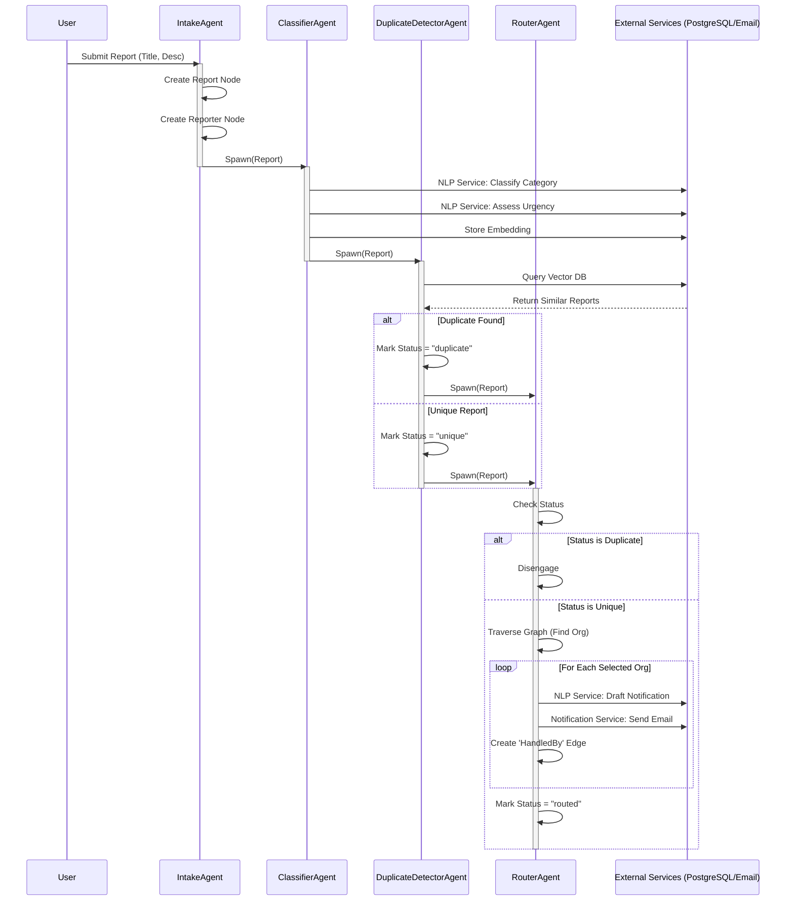

# Agent Interaction Diagram

This diagram illustrates the multi-agent workflow in Dira, showing how a report is processed from submission to routing.

## Agent Responsibilities

| Agent | Responsibility | Triggers |
|-------|----------------|----------|
| **IntakeAgent** | Validates input, creates graph nodes, initializes report state. | User submission via API/Frontend. |
| **ClassifierAgent** | Uses NLP Service to determine category and urgency. Stores vector embeddings. | Spawning by `IntakeAgent`. |
| **DuplicateDetectorAgent** | Queries vector database to find semantic duplicates. Updates status. | Spawning by `ClassifierAgent`. |
| **RouterAgent** | Traverses OSP graph to find relevant organizations. Drafts messages via NLP Service and sends notifications. | Spawning by `DuplicateDetectorAgent`. |
