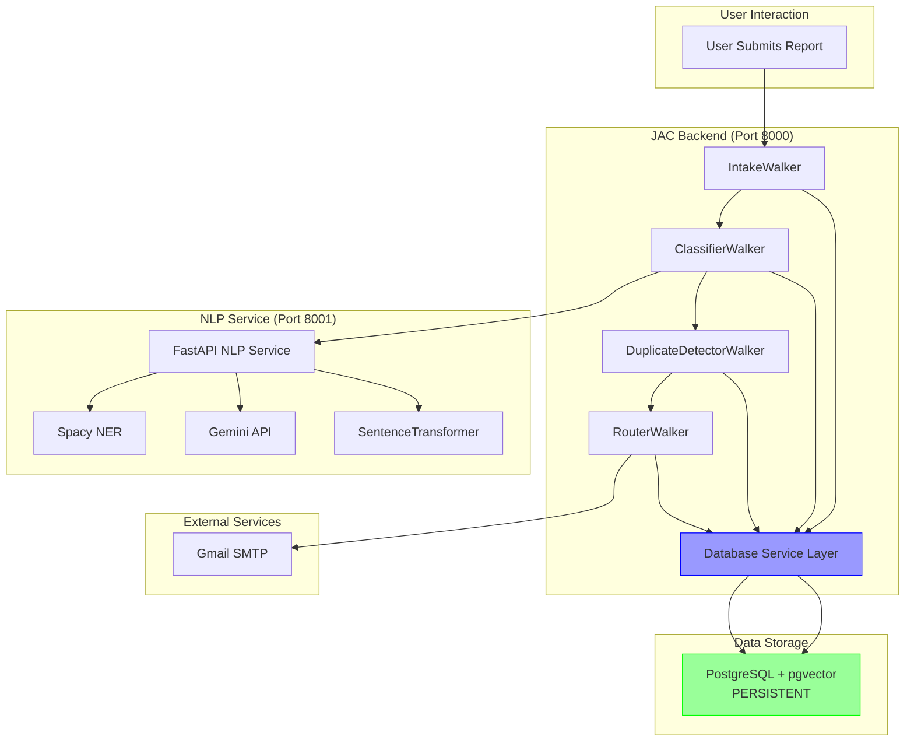

# PostgreSQL Migration Plan for Dira

## Goal
Migrate from ephemeral JAC session files to persistent PostgreSQL storage with pgvector for embeddings.

## Current State
- **Data**: Stored in `backend/jac/main.session` (ephemeral, lost on restart)
- **Embeddings**: Not stored anywhere (Weaviate disconnected)
- **PostgreSQL**: Provisioned on Heroku but unused

## Migration Steps

### Phase 1: Setup PostgreSQL with pgvector ✓
**Duration**: ~30 mins

1. Enable pgvector extension on Heroku Postgres
2. Create database schema (tables for Organisations, Reports, etc.)
3. Create embeddings table with vector column
4. Test connection from backend

### Phase 2: Create Database Layer
**Duration**: ~2 hours

1. Create Python database models (SQLAlchemy)
2. Create CRUD operations for:
   - Organisations
   - Facilities
   - Reporters
   - Reports
3. Create vector operations (store/search embeddings)

### Phase 3: Modify JAC Backend
**Duration**: ~3 hours

1. Update walkers to use PostgreSQL instead of JAC nodes:
   - IntakeWalker → Insert into DB
   - ClassifierWalker → Update DB records
   - DuplicateDetectorWalker → Query pgvector
   - RouterWalker → Read from DB
2. Keep JAC for orchestration/business logic
3. Remove dependency on session files

### Phase 4: Data Seeding
**Duration**: ~1 hour

1. Seed initial organisations
2. Migrate any existing session data (if any)
3. Create test reports

### Phase 5: Testing & Deployment
**Duration**: ~2 hours

1. Test locally with PostgreSQL
2. Update Dockerfile to install psycopg2
3. Deploy to Heroku
4. Verify data persistence after dyno restart

---

## Database Schema

```sql
-- Enable pgvector extension
CREATE EXTENSION IF NOT EXISTS vector;

-- Organisations table
CREATE TABLE organisations (
    id UUID PRIMARY KEY DEFAULT gen_random_uuid(),
    name VARCHAR(255) NOT NULL,
    type VARCHAR(50) NOT NULL, -- government, utility, etc.
    contact_email VARCHAR(255),
    contact_api TEXT,
    facilities JSONB, -- Store as JSON array
    created_at TIMESTAMP DEFAULT NOW()
);

-- Facilities table
CREATE TABLE facilities (
    id UUID PRIMARY KEY DEFAULT gen_random_uuid(),
    name VARCHAR(255) NOT NULL,
    location VARCHAR(255),
    organisation_id UUID REFERENCES organisations(id) ON DELETE CASCADE,
    created_at TIMESTAMP DEFAULT NOW()
);

-- Reporters table
CREATE TABLE reporters (
    id UUID PRIMARY KEY DEFAULT gen_random_uuid(),
    name VARCHAR(255),
    email VARCHAR(255),
    is_anonymous BOOLEAN DEFAULT FALSE,
    created_at TIMESTAMP DEFAULT NOW()
);

-- Reports table
CREATE TABLE reports (
    id UUID PRIMARY KEY DEFAULT gen_random_uuid(),
    title VARCHAR(500) NOT NULL,
    description TEXT NOT NULL,
    category VARCHAR(50), -- infrastructure, safety, utility
    urgency VARCHAR(20), -- low, medium, high
    entities JSONB, -- Extracted entities
    confidence FLOAT,
    status VARCHAR(50) DEFAULT 'submitted', -- submitted, routed, resolved, duplicate
    submitted_at TIMESTAMP DEFAULT NOW(),
    reporter_id UUID REFERENCES reporters(id),
    image_data TEXT, -- Base64 encoded
    analysis_result TEXT, -- AI analysis
    embedding vector(384), -- Sentence transformer dimension
    created_at TIMESTAMP DEFAULT NOW()
);

-- Report routing table (which orgs received which reports)
CREATE TABLE report_routes (
    id UUID PRIMARY KEY DEFAULT gen_random_uuid(),
    report_id UUID REFERENCES reports(id) ON DELETE CASCADE,
    organisation_id UUID REFERENCES organisations(id) ON DELETE CASCADE,
    message TEXT,
    sent_at TIMESTAMP DEFAULT NOW(),
    status VARCHAR(50) DEFAULT 'sent'
);

-- Related reports (duplicates/similar)
CREATE TABLE related_reports (
    id UUID PRIMARY KEY DEFAULT gen_random_uuid(),
    report_id UUID REFERENCES reports(id) ON DELETE CASCADE,
    related_report_id UUID REFERENCES reports(id) ON DELETE CASCADE,
    similarity_score FLOAT,
    relationship_type VARCHAR(50) DEFAULT 'duplicate', -- duplicate, similar
    created_at TIMESTAMP DEFAULT NOW(),
    UNIQUE(report_id, related_report_id)
);

-- Indexes for performance
CREATE INDEX idx_reports_status ON reports(status);
CREATE INDEX idx_reports_category ON reports(category);
CREATE INDEX idx_reports_submitted_at ON reports(submitted_at DESC);
CREATE INDEX idx_report_routes_report_id ON report_routes(report_id);
CREATE INDEX idx_report_routes_org_id ON report_routes(organisation_id);

-- Vector similarity search index (HNSW for fast approximate search)
CREATE INDEX ON reports USING hnsw (embedding vector_cosine_ops);
```

---

## Updated Architecture



---

## Benefits After Migration

✅ **Data Persistence** - No data loss on dyno restarts  
✅ **Duplicate Detection** - pgvector enables fast similarity search  
✅ **Scalability** - Can add read replicas, connection pooling  
✅ **Backup/Restore** - Heroku Postgres has automatic backups  
✅ **Analytics** - Can run SQL queries for insights  
✅ **Multi-instance** - Multiple dynos can share same database  

---

## Risks & Mitigation

**Risk**: Breaking existing functionality during migration  
**Mitigation**: 
- Keep JAC session as fallback during testing
- Incremental migration (start with new reports only)
- Extensive testing before full cutover

**Risk**: Performance degradation  
**Mitigation**:
- Use proper indexes
- Connection pooling
- Async database operations

**Risk**: Cost increase  
**Mitigation**:
- Start with Hobby Dev plan ($0-5/month)
- Monitor usage
- Upgrade only if needed

---

## Next Steps

1. ✅ Fix GitHub Actions (DONE)
2. ⏳ Review and approve this plan
3. 🔧 Start Phase 1: Setup PostgreSQL with pgvector
4. 🔧 Continue with remaining phases

**Estimated Total Time**: ~8-10 hours  
**Can be done incrementally**: Yes, in phases

Ready to start Phase 1?
