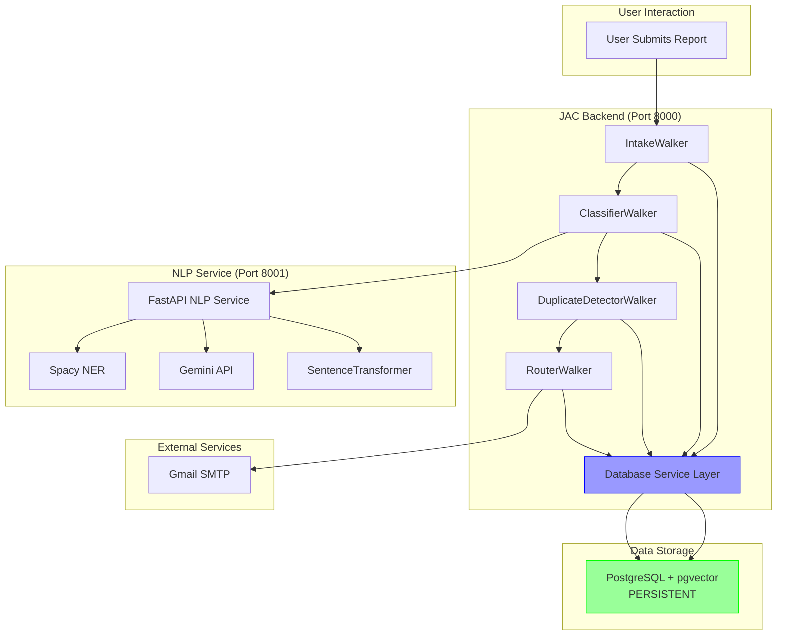

---

## Database Schema

```sql
-- Enable pgvector extension
CREATE EXTENSION IF NOT EXISTS vector;

-- Organisations table
CREATE TABLE organisations (
    id UUID PRIMARY KEY DEFAULT gen_random_uuid(),
    name VARCHAR(255) NOT NULL,
    type VARCHAR(50) NOT NULL, -- government, utility, etc.
    contact_email VARCHAR(255),
    contact_api TEXT,
    facilities JSONB, -- Store as JSON array
    created_at TIMESTAMP DEFAULT NOW()
);

-- Facilities table
CREATE TABLE facilities (
    id UUID PRIMARY KEY DEFAULT gen_random_uuid(),
    name VARCHAR(255) NOT NULL,
    location VARCHAR(255),
    organisation_id UUID REFERENCES organisations(id) ON DELETE CASCADE,
    created_at TIMESTAMP DEFAULT NOW()
);

-- Reporters table
CREATE TABLE reporters (
    id UUID PRIMARY KEY DEFAULT gen_random_uuid(),
    name VARCHAR(255),
    email VARCHAR(255),
    is_anonymous BOOLEAN DEFAULT FALSE,
    created_at TIMESTAMP DEFAULT NOW()
);

-- Reports table
CREATE TABLE reports (
    id UUID PRIMARY KEY DEFAULT gen_random_uuid(),
    title VARCHAR(500) NOT NULL,
    description TEXT NOT NULL,
    category VARCHAR(50), -- infrastructure, safety, utility
    urgency VARCHAR(20), -- low, medium, high
    entities JSONB, -- Extracted entities
    confidence FLOAT,
    status VARCHAR(50) DEFAULT 'submitted', -- submitted, routed, resolved, duplicate
    submitted_at TIMESTAMP DEFAULT NOW(),
    reporter_id UUID REFERENCES reporters(id),
    image_data TEXT, -- Base64 encoded
    analysis_result TEXT, -- AI analysis
    embedding vector(384), -- Sentence transformer dimension
    created_at TIMESTAMP DEFAULT NOW()
);

-- Report routing table (which orgs received which reports)
CREATE TABLE report_routes (
    id UUID PRIMARY KEY DEFAULT gen_random_uuid(),
    report_id UUID REFERENCES reports(id) ON DELETE CASCADE,
    organisation_id UUID REFERENCES organisations(id) ON DELETE CASCADE,
    message TEXT,
    sent_at TIMESTAMP DEFAULT NOW(),
    status VARCHAR(50) DEFAULT 'sent'
);

-- Related reports (duplicates/similar)
CREATE TABLE related_reports (
    id UUID PRIMARY KEY DEFAULT gen_random_uuid(),
    report_id UUID REFERENCES reports(id) ON DELETE CASCADE,
    related_report_id UUID REFERENCES reports(id) ON DELETE CASCADE,
    similarity_score FLOAT,
    relationship_type VARCHAR(50) DEFAULT 'duplicate', -- duplicate, similar
    created_at TIMESTAMP DEFAULT NOW(),
    UNIQUE(report_id, related_report_id)
);

-- Indexes for performance
CREATE INDEX idx_reports_status ON reports(status);
CREATE INDEX idx_reports_category ON reports(category);
CREATE INDEX idx_reports_submitted_at ON reports(submitted_at DESC);
CREATE INDEX idx_report_routes_report_id ON report_routes(report_id);
CREATE INDEX idx_report_routes_org_id ON report_routes(organisation_id);

-- Vector similarity search index (HNSW for fast approximate search)
CREATE INDEX ON reports USING hnsw (embedding vector_cosine_ops);
```

---

## Updated Architecture



---
